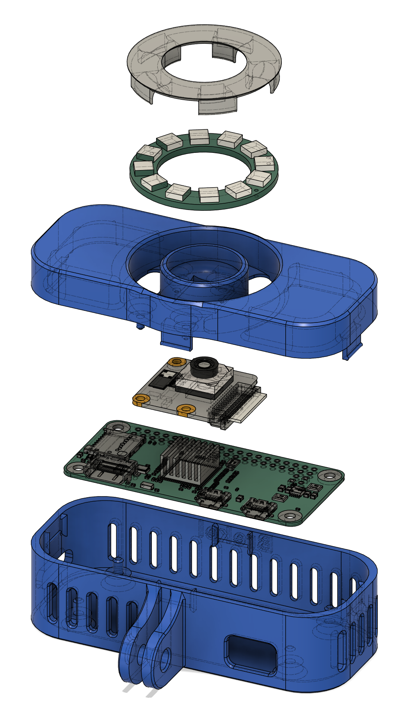

# raspi-facecam

Scripts to download &amp; install [camera-streamer](https://github.com/ayufan/camera-streamer) and apply optimal settings for a [Raspberry Pi Zero 2](https://www.raspberrypi.com/products/raspberry-pi-zero-2-w) with [Camera Module v3](https://www.raspberrypi.com/products/camera-module-3) to live stream video data at the highest possible frame rate.


The primary use case is as a wireless HMC (Helmet Mounted Camera) for facial motion capture.  
For example the [Brekel Body v3 software](https://brekel.com/brekel-body-v3) can utilize this with it's face tracking functionality.


This is designed to be used with a 3D printed case that can be downloaded from the following page(s) (more info on bill of materials and assembly instructions there):  
 [Printables](https://www.printables.com/model/805075-rasberry-pi-zero-face-camera)
 


## Installation
(you can find a more step-by step guide in PDF form in the documentation folder)

* Use the Raspberry Pi Imager to install the 64-bit Lite version of Raspberry Pi OS
* Make sure to configure your WiFi settings using the "Edit Settings" option and enable SSH
* Once completed you can insert the SD-Card into the Pi through the side hole, you may need a small screw driver or tweezers to carefully slide it into place (this was deliberately designed so it takes some effort to remove)
* SSH into your Pi

### run the following commands to make sure git is available
```bash
sudo apt install git
```

### run the following commands to download &amp; install the software (or if you want to update things in the future)
```bash
git clone https://github.com/Brekel/raspi-facecam.git
cd raspi-facecam
./install_camera-streamer.sh
```

Installation can take 5-10 minutes (depending on your SD-card and internet speed)
When finished you can access the video stream over the listed http listed in the console.
